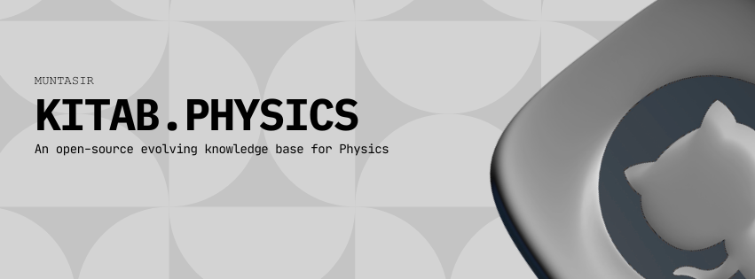

# Kitab.Physics

Welcome to **Kitab.Physics**, your companion in exploring the fundamental laws of the universe.

---

## 📖 What is Kitab.Physics?

Kitab.Physics is a **community-powered library** designed to make physics accessible to everyone.  
We gather the best concepts, formulas, and insights from across the world of science into one simple, searchable place.

---

## 🌍 Our Vision

We believe that understanding the universe should be an **open door for everyone**.  
Whether you are just starting your journey into mechanics or looking for deep dives into quantum theory, Kitab.Physics is here to help you grow and share your knowledge with fellow explorers around the world.

---

🔗 Visit [Kitab.Physics](https://physics.muntasir.site)

